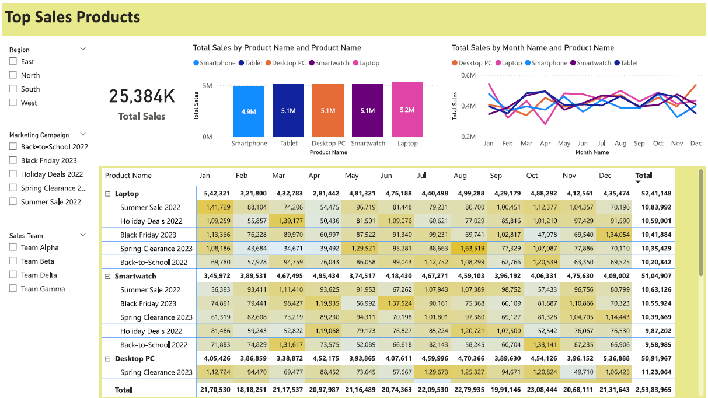

# **Top-Selling Products Analysis Case Study**

## **Overview**
This project was created to assist **Charlie Thompson**, the Director of Product Strategy, in understanding the performance of a product lineup launched over the past year. The primary objective was to identify the top-selling products and sales trends to guide decisions in inventory management, marketing strategies, and product development.

The analysis was performed using **Power BI** and **Python** for data preprocessing, providing actionable insights through an interactive dashboard.

---

## **Problem Statement**
The client sought answers to key business questions:
1. **Sales Performance**: What is the yearly sales performance of all products launched in the past year?
2. **Top Performers**: Which products have consistently ranked as the top sellers?
3. **Trends Over Time**: Are newly launched products gaining or losing customer interest over time?
4. **Sales Hierarchy**: How do products compare in terms of sales contributions?
5. **Marketing Effectiveness**: How do marketing efforts correlate with sales trends?

To address these, the project leveraged **data analysis** and **visualization tools** to extract meaningful insights.

---

## **Objectives**
The primary goals of this project were:
- To evaluate the sales performance of all products and identify top-selling items.
- To visualize the sales trends and their correlation with external factors like marketing campaigns.
- To assist stakeholders in optimizing inventory and marketing strategies based on data-driven insights.

---

## **Solution Approach**
The analysis followed these steps:

### **1. Data Collection & Preprocessing**
- The raw dataset contained product sales data for the past year, including timestamps, sales amounts, product categories, and marketing event markers.
- **Python** was used to clean and preprocess the data:
  - Removed null/duplicate entries.
  - Standardized column formats (e.g., dates, categories).
  - Added calculated columns for sales metrics.

### **2. Key Metrics Defined**
- **Total Sales**: Aggregated sales figures across all products.
- **Top-Selling Products**: Products ranked based on total sales amounts.
- **Monthly Sales Trends**: Time-series data of product sales over each month.
- **Marketing Impact**: Sales spikes during promotional periods.

### **3. Interactive Power BI Dashboard**
The processed data was imported into **Power BI** to create an intuitive and visually appealing dashboard. Key elements included:
- **Yearly Sales Overview**: A bar chart to compare total sales by product category.
- **Top Performers**: A table highlighting products with the highest sales.
- **Sales Trends Over Time**: Line graphs showing monthly performance for new products.
- **Marketing Correlation**: Scatter plots displaying the relationship between marketing efforts and sales.

### **4. DAX Measures Used in Power BI**
- **Total Sales Measure**:  
  ```DAX
  Total Sales = SUM(SalesData[Sales Amount])
  ```

- **Top Products by Rank**:  
  ```DAX
  Top Products = 
  RANKX(
      ALL(SalesData[Product Name]), 
      CALCULATE(SUM(SalesData[Sales Amount]))
  )
  ```

- **Date Table Creation**:  
  ```DAX
  Date = 
  ADDCOLUMNS(
      CALENDAR(MIN(SalesData[Sale Date]), MAX(SalesData[Sale Date])),
      "Year", YEAR([Date]),
      "Month", FORMAT([Date], "MMMM"),
      "Month Number", MONTH([Date]),
      "Quarter", "Q" & QUARTER([Date])
  )
  ```

---

## **Project Features**
- **Dynamic Dashboards**: Interactive Power BI dashboards offering insights into sales performance and trends.
- **Product Insights**: Focused analysis of newly launched products to evaluate customer interest over time.
- **Correlation Analysis**: Insights into how marketing efforts influence sales patterns.
- **Customizable Visuals**: Charts and tables designed to be updated with real-time data.

---

## **Results**
### Key Findings:
1. **Top Performers**:  
   - Laptops were the highest-selling product, contributing **20.65%** to the total revenue.
   - Smartwatch and Desktop PC followed as the next best performers.

2. **Sales Trends**:  
   - Sales Trends remain continous through out the year.
   - Summer Sale 2022 show more sales numbers and Black Friday Sale 2023 show least.

3. **Insights for Action**:
   - Allocate more marketing budget to top-performing products.
   - Optimize inventory levels to ensure sufficient stock of high-demand items.
   - Introduce promotions for underperforming products to boost sales.

---

## Yearly Product Sales Overview
This section provides an overview of sales for all products launched in the past year.



---

## **Tools Used**
1. **Power BI**: For visualization and dashboard creation.
2. **DAX (Data Analysis Expressions)**: To calculate custom measures and KPIs in Power BI.
3. **Excel/CSV Files**: For initial data input and export.

---

## **Folder Structure**
- **Data**: Contains the raw and cleaned datasets used for analysis.
- **Power BI Files**: `.pbix` files with the dashboards and visualizations.
- **Documentation**: Includes this README and project documentation.

---

## **How to Run This Project**
### Prerequisites:
- Install **Power BI Desktop** for viewing and interacting with the dashboards.


### Steps:
1. Clone this repository:
   ```bash
   git clone https://github.com/your-repo/top-selling-products.git
   cd top-selling-products
   ```
2. Open the Power BI file (`TopSellingProducts.pbix`) in **Power BI Desktop**.
3. Explore the interactive dashboard and insights.

---

## **Future Enhancements**
1. **Real-Time Data Integration**: Automate the dashboard updates with live data feeds.
2. **Predictive Analysis**: Add machine learning models to forecast product demand.
3. **Advanced Insights**: Include customer segmentation for more targeted marketing.

---

## **Contributors**
- **Your Name** - Data Analysis, Dashboard Development, and Documentation.

---

## **License**
This project is licensed under the MIT License. See the LICENSE file for details.
